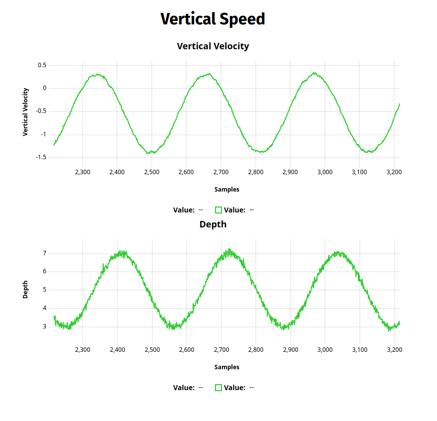
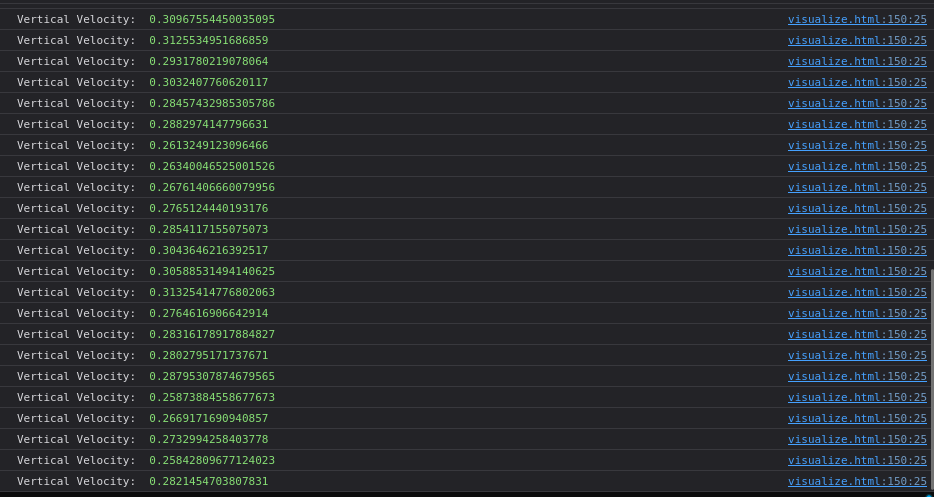

# vertical-velocity
This repository contains code to fuse data from IMU and depth sensor to estimate the vertical velocity of an AUV. 

## How to run
### Running the container
Assuming docker and docker-compose are installed [Guide](https://docs.docker.com/engine/install/ubuntu/), run the following commands in the directory containing `dockerfile` and `docker-compoase.yml`:
1. Build the docker image: `docker compose build`
2. Start the container:    `docker compose up`
This will start the depth sensor and IMU simulation nodes, as well as the sensor fusion node and the ros bridge.

### Validating rosbridge
A python installation is required to view the html file. This is due to CORS not allowing uPlot and other JS scripts to run without a server.

Start a python server in the directory containing `visualize.html` using 
```
python3 -m http.server .
```
This should start a http server serving on localhost:8080. View the html at: [http://localhost:8000/visualize.html](http://localhost:8000/visualize.html)

## Assumptions made
1. The AUV is moving forward with constant unit velocity, while changing depth along the curve of the equation: `depth = 5 + 2 * sin(0.2 * t)`
2. Orientation and linear acceleration values from the IMU are already processed and provide a decent estimate of the real world

## Rosbridge
Rosbridge snippet can be found in `visualize.html`, lines 118-150. Given below is a screenshot of the vertical velocity plot


## Additional
`analysis/analysis.ipynb` contains the initial tests done before implementing the filtering logic in ROS. The idea was to use some sort of optimization to tune R and Q to get a smoother velocity estimate from the kalman filter. But accidentally I found a decent enough estimate during the initial trial and error so I let that be a good checkpoint.

If I am able to do it within the rest of the deadline, I'd like to implement that as well